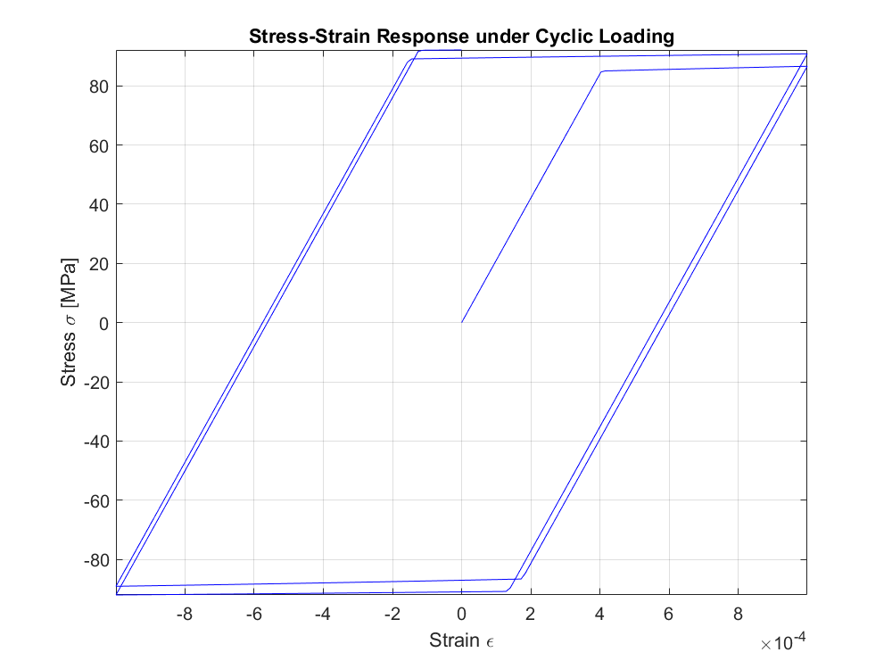

# Projects in Advanced Solid Mechanics

*Stress-strain response under cyclic loading for a 1D plasticity model with nonlinear isotropic hardening, implemented in MATLAB.*

---

## 📖 Table of Contents

-   [1. Project Overview](#1-project-overview)
-   [2. Exercise 1: Stiffness Matrix of a Hexahedral Element](#2-exercise-1-stiffness-matrix-of-a-hexahedral-element)
-   [3. Exercise 2: 1D Plasticity with Nonlinear Hardening](#3-exercise-2-1d-plasticity-with-nonlinear-hardening)
-   [4. Exercise 3: Polar Decomposition of the Deformation Gradient](#4-exercise-3-polar-decomposition-of-the-deformtion-gradient)
-   [5. Exercise 4: Total vs. Updated Lagrangian Formulations](#5-exercise-4-total-vs-updated-lagrangian-formulations)
-   [6. Technologies Used](#6-technologies-used)

---

## 1. Project Overview

This repository contains a collection of projects developed for a course in Advanced Solid Mechanics. The work covers fundamental topics in computational mechanics, including Finite Element Analysis (FEA), material plasticity, and nonlinear continuum mechanics.

The projects are implemented primarily in **MATLAB** and demonstrate both theoretical understanding and practical coding skills.

---

## 2. Exercise 1: Stiffness Matrix of a Hexahedral Element

This exercise details the theoretical formulation and numerical implementation for computing the **stiffness matrix (K)** of a 3D linear hexahedral ("brick") finite element.

### Methodology
The process involves several key steps grounded in FEA principles:
1.  **Shape Functions:** Defining the trilinear shape functions $N_i(\xi, \eta, \zeta)$ in the natural coordinate system.
2.  **Jacobian Matrix:** Calculating the Jacobian matrix $\mathbf{J}$ to map between natural and global coordinates.
3.  **Strain-Displacement Matrix (B):** Assembling the matrix $\mathbf{B}$ which relates nodal displacements to element strains.
4.  **Constitutive Matrix (D):** Defining the material's stress-strain relationship for a linear isotropic material.
5.  **Numerical Integration:** Using **Gaussian Quadrature** (2x2x2 scheme) to integrate the product $\mathbf{B}^T \mathbf{D} \mathbf{B}$ over the element's volume to compute the final $24 \times 24$ stiffness matrix $\mathbf{K}$.

The full MATLAB implementation is provided within the project files and follows this standard, robust procedure for element formulation.

---

## 3. Exercise 2: 1D Plasticity with Nonlinear Hardening

This exercise presents a MATLAB implementation of a 1D plasticity model featuring **nonlinear isotropic hardening**. The goal is to simulate the stress-strain response of a material under cyclic loading.

### Constitutive Model
The simulation is based on a yield function that evolves with plastic deformation:
$$ f = |\sigma| - \sigma_y(\alpha) $$
where the yield stress $\sigma_y$ hardens according to the law:
$$ \sigma_y(\alpha) = \sigma_{y0} + h_1(1-e^{-h_2\alpha}) $$
Here, $\alpha$ is an internal variable representing the accumulated plastic strain.

### Numerical Implementation
The solution employs a standard **elastic predictor-plastic corrector** algorithm. For each strain increment, a trial stress is computed. If the yield criterion is violated, a plastic correction is applied using an iterative **Newton-Raphson scheme** to return the stress state to the updated yield surface.

### Results
The code generates the stress-strain diagram shown below, which clearly illustrates the material's behavior:
-   Initial linear elastic response.
-   Onset of plastic deformation at the initial yield stress ($\sigma_{y0} = 85$ MPa).
-   Nonlinear hardening as the material deforms plastically.
-   A symmetric hysteresis loop characteristic of isotropic hardening under cyclic loading.

---

## 4. Exercise 3: Polar Decomposition of the Deformation Gradient

This exercise focuses on the kinematics of large deformations by performing a **polar decomposition** of a given deformation gradient tensor $\mathbf{F}$.

### Problem Statement
Given the deformation gradient $\mathbf{F}$ evaluated at a specific point, we decompose it into a pure rotation and a pure stretch:
$$ \mathbf{F} = \mathbf{R} \mathbf{U} = \mathbf{V} \mathbf{R} $$
where:
-   $\mathbf{R}$ is the rotation tensor.
-   $\mathbf{U}$ is the right stretch tensor.
-   $\mathbf{V}$ is the left stretch tensor.

### Methodology
The tensors are calculated numerically using a spectral decomposition approach in MATLAB:
1.  Compute the right and left Cauchy-Green deformation tensors: $\mathbf{C} = \mathbf{F}^T \mathbf{F}$ and $\mathbf{B} = \mathbf{F} \mathbf{F}^T$.
2.  Perform an eigendecomposition of $\mathbf{C}$ and $\mathbf{B}$ to find their eigenvalues and eigenvectors.
3.  Construct the stretch tensors as $\mathbf{U} = \sqrt{\mathbf{C}}$ and $\mathbf{V} = \sqrt{\mathbf{B}}$.
4.  Calculate the rotation tensor as $\mathbf{R} = \mathbf{F} \mathbf{U}^{-1}$.

The numerical results confirm the theoretical properties of the tensors, such as the symmetry of $\mathbf{U}$ and $\mathbf{V}$ and the orthogonality of $\mathbf{R}$.

---

## 5. Exercise 4: Total vs. Updated Lagrangian Formulations

This section provides a theoretical overview of the two fundamental frameworks for solving problems in nonlinear solid mechanics: the **Total Lagrangian (TL)** and **Updated Lagrangian (UL)** formulations.

### Key Differences
-   **Reference Configuration:**
    -   **TL:** All kinematic and static variables are referred to the initial, undeformed configuration (time $t=0$). It uses the 2nd Piola-Kirchhoff stress and Green-Lagrange strain.
    -   **UL:** All variables are referred to the current, deformed configuration (time $t$). It uses the Cauchy stress and infinitesimal strain.
-   **Applicability:**
    -   **TL** is often more efficient for problems with small to moderate strains but large rotations.
    -   **UL** is generally preferred for problems involving very large strains, contact, and complex material laws defined in the current configuration.

### Conclusion
While mathematically equivalent, the choice between TL and UL depends on the specific problem, including the magnitude of deformations, the nature of the material model, and computational efficiency requirements. Both lead to a nonlinear system of equations that is typically solved iteratively using the Newton-Raphson method, requiring the computation of a tangent stiffness matrix.

---

## 6. Technologies Used

-   **Primary Tool:** MATLAB
-   **Documentation:** LaTeX

---
